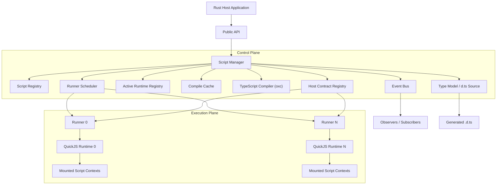
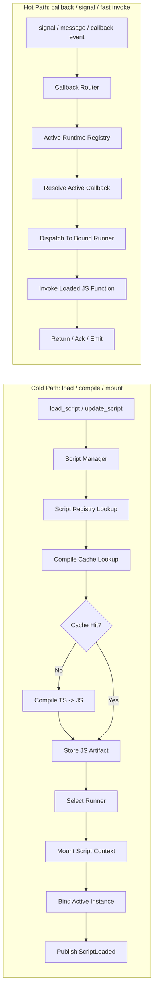
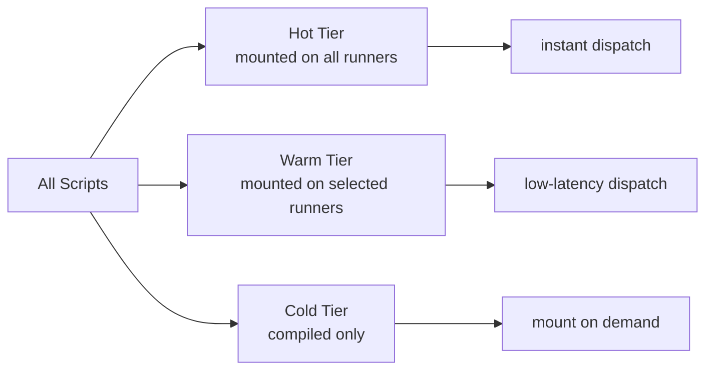
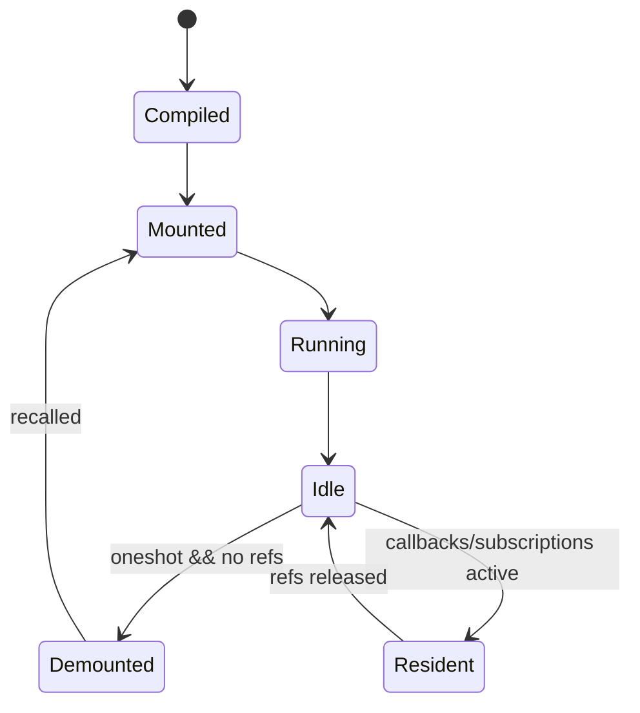

# Architecture Notes

## Intent

Build an embedded TypeScript scripting platform for Rust applications, not just a thin TS executor.

Primary goals:

- embed into unrelated Rust projects
- accept TypeScript at runtime
- compile TypeScript to JavaScript with `oxc`
- cache compiled artifacts
- execute with `rquickjs`
- support multiple runners
- keep hot paths extremely fast
- support long-lived callbacks/messages/signals
- expose Rust host APIs to scripts in a typed way
- generate `*.d.ts` from the host-side type model

## Core Direction

The central component must be a `Script Manager`.

The `Script Manager`:

- receives public API requests
- owns script lifecycle decisions
- compiles and caches scripts before execution
- chooses which runner executes what
- tracks mounted and active script instances
- owns registries and orchestration

Runners should stay focused on execution only.

Runners should not:

- own compile policy
- own cache policy
- decide script lifecycle globally
- act as the source of truth for script metadata

Important clarification:

- the `Script Manager` should be treated as an orchestration façade
- it should delegate to specialized subsystems
- it should not collapse into a god object

## High-Level Pipeline



## Registries

### 1. Script Registry

Tracks script material and cache-related metadata.

Should contain:

- `script_id`
- TypeScript source
- compiled JavaScript artifact
- source hash
- version/generation
- cache metadata
- preferred affinity if relevant

This registry is about script materialization, not execution requests.

### 2. Host Contract Registry

Tracks Rust-side exposed capabilities.

Should contain at least:

- host functions
- host callbacks
- host contexts
- type metadata
- request/response/message schemas

This registry exists to support both runtime bridge behavior and generated `.d.ts` output.

The older name `Request Registry` is too weak and too narrow.

This registry does not only describe requests.

It describes host-side contracts.

### 3. Active Runtime Registry

Tracks mounted/active instances currently alive in runners.

Should contain at least:

- mounted instance id
- `script_id -> runner_id`
- active callback bindings
- context state
- hot subscriptions
- current generation/reload state

This registry is critical for fast callback dispatch.

## Type Model

Need a first-class host type system, not just ad-hoc injected functions.

Planned categories:

- `Function`
- `Callback`
- `Context`

### Function

Simple host callable contract.

Expected fields:

- name
- input schema
- output schema

### Callback

Message/signal-driven contract.

Expected fields:

- name
- message schema
- delivery mode
- hot/persistent flag

### Context

A richer injected host object.

Expected fields:

- context name
- methods
- events
- shared state shape

Reason this matters:

- cleaner host bridge architecture
- easier `.d.ts` and SDK generation
- explicit contracts for Rust <-> TS interaction

## Rust-Declared Host Model

The source of truth must come from Rust trait declarations made by the application embedding the library.

This is a core architectural rule.

The library must not hardcode domain callbacks such as `player.onDamage`.

Instead, the embedding application declares host capabilities through Rust traits and registrations.

Example direction:

```rust
#[derive(TsCallback)]
struct PlayerDamage {
    player_id: u64,
    amount: f32,
    source: DamageSource,
}

impl HostCallback for PlayerDamage {
    const NAME: &'static str = "player.damage";
}
```

Then registration should look conceptually like:

```rust
manager
    .registry()
    .callback::<PlayerDamage>()
    .function::<FindUser>()
    .context::<OverlayContext>();
```

From this declaration model, the library should be able to derive:

1. runtime callback name
2. payload schema
3. internal route
4. validation metadata if enabled
5. generated `.d.ts`
6. optional generated TypeScript SDK surface

### Flow of Truth

```text
Rust trait impl
  -> Host Registry
  -> runtime callback route
  -> TS type model
  -> generated .d.ts
  -> optional generated SDK wrapper
```

This is strictly better than hand-maintained runtime strings being the main source of truth.

### Generic Callback Core

The core callback trait should stay generic.

Conceptual direction:

```rust
pub trait HostCallback {
    const NAME: &'static str;
    type Payload: Serialize + DeserializeOwned + TsType;

    fn delivery() -> DeliveryMode {
        DeliveryMode::Broadcast
    }

    fn hot() -> bool {
        true
    }
}
```

Example:

```rust
struct ScoreUpdate;

impl HostCallback for ScoreUpdate {
    const NAME: &'static str = "score.update";
    type Payload = ScoreUpdatePayload;
}
```

Emission direction:

```rust
manager.emit::<ScoreUpdate>(ScoreUpdatePayload {
    combo: 420,
    accuracy: 98.7,
}).await?;
```

### Generated TypeScript Shape

A minimal generated TypeScript event model is already enough:

```ts
type HostEvents = {
  "score.update": {
    combo: number;
    accuracy: number;
  };
};

declare const ctx: {
  on<K extends keyof HostEvents>(
    event: K,
    handler: (payload: HostEvents[K]) => void | Promise<void>
  ): void;
};
```

Usage:

```ts
ctx.on("score.update", event => {
  ctx.log(`${event.combo}x`);
});
```

This is a strong starting point even before a richer object-oriented SDK exists.

### Two-Layer Model

This architecture should explicitly separate:

| Layer | Role |
| --- | --- |
| typed Rust registry | source of truth |
| generated TypeScript SDK | user ergonomics |

The generated SDK can start minimal.

The most important property is:

- the host application declares callbacks/functions/contexts
- the library derives runtime routing and type output from those declarations

So callbacks are not invented by the library.

They are declared by the embedding application, and the library provides:

- the registry
- the routing
- the runtime bridge
- the lifecycle
- the type generation

### Runtime Core vs Generated SDK

The final TypeScript API can be ergonomic, but the runtime core should stay simpler and more stable.

This means:

- the runtime bridge can remain low-level internally
- the user-facing TypeScript SDK can be generated on top

Conceptual split:

```ts
__host.call("user.find", payload)
__host.on("score.update", handler)
```

Then generated into:

```ts
user.find(1)
ctx.on("score.update", event => {})
```

This prevents the native bridge layer from becoming too magical or too hard to stabilize early.

## Async Host Bridge Model

The current async host function support is intentionally explicit:

```rust
enum HostFunctionExecution {
    Sync,
    AsyncBlockingJs,
    AsyncPromise,
}
```

Current state:

- `Sync` means a synchronous Rust function and synchronous JS bridge call
- `AsyncBlockingJs` means the Rust future is spawned on Tokio, but the current JS bridge waits for the result
- `AsyncPromise` means the experimental async worker-lane Promise bridge

This prevents a false claim that async Rust automatically means non-blocking scripts.

True non-blocking script behavior requires the async runner path:

```text
rquickjs/futures feature
  -> AsyncRuntime / AsyncContext
  -> Promise::wrap_future or equivalent
  -> runner job driving QuickJS futures
  -> JS call receives a real Promise
```

This is implemented as a runner/runtime capability, not as a compatibility shim around the current synchronous bridge.

The legacy `AsyncBlockingJs` mode is still useful for running host work on Tokio but should be documented and treated as blocking from the script point of view.

Current implementation status:

- `[V0]` `HostFunctionExecution::Sync` returns direct values in `.d.ts`
- `[V0]` `HostFunctionExecution::AsyncBlockingJs` also returns direct values because JS waits for completion today
- `[V0]` `HostFunctionExecution::AsyncPromise` renders `Promise<T>` in `.d.ts` and is supported by the experimental AsyncContext host bridge
- `[V0]` the `async-promise` feature enables `rquickjs/futures`
- `[V0]` `tests/async_promise_capability.rs` proves a Rust future can be awaited as a JavaScript Promise through `AsyncRuntime` / `AsyncContext`
- `[V0]` `runner::async_host_bridge` provides an AsyncContext-based host bridge that exposes registered async-promise functions as real JavaScript Promises
- `[V0]` `AsyncScriptRuntime` provides an experimental low-level ESM runtime that can await host Promises inside exported functions
- `[V0]` `TsVm::load_async_script` and `TsVm::load_async_script_project` reuse manager compile/cache and host registry, then mount scripts into a manager-owned async worker lane
- `[V0]` async worker-lane scripts are visible in the script registry with `preferred_runner: Some(worker_id)` and transition back to `Compiled` when their handle is dropped
- `[V0]` async worker-lane drop cleanup is source-hash guarded so stale handles cannot demount newer same-id loads
- `[V0]` async worker-lane scripts publish dedicated lifecycle/call events with async worker affinity
- `[V0]` async worker-lane scripts are counted in `VmStats.loaded_scripts` and `VmStats.memory.active_scripts` while mounted
- `[V0]` the synchronous worker rejects `AsyncPromise` contracts at script load time instead of exposing them as fake direct-return functions
- `[V0]` the async worker lane runs dedicated worker threads with bounded command queues and oneshot replies, keeping non-`Send` QuickJS async runtimes inside their owning worker thread
- `[V0]` `emit_async` uses a native async path for async worker-lane event delivery; sync worker targets are delegated through Tokio blocking tasks
- `[V0]` async-promise host functions are spawned onto the registering Tokio runtime, so multiple JavaScript `Promise` host calls can overlap instead of serializing inside the QuickJS worker lane
- `[V0]` async worker commands are still processed in order per worker lane; broader same-lane command interleaving is a later design decision because QuickJS runtime/context ownership must stay explicit

## Contract Model

Rust-side traits are not just runtime hooks.

This is a structural decision:

> Rust traits are the source of truth for host API contracts.

A registered host item must produce:

- runtime binding metadata
- input/output schema or payload schema
- TypeScript declaration metadata generated from schema
- optional validation metadata
- stable registry identity

This means traits are not only used to execute code.

They define the contract consumed by:

- the script runtime
- the host bridge
- the host contract registry
- the future SDK/type generation pipeline

### Contract Pipeline

```text
Rust trait / derive
  -> runtime registration
  -> schema
  -> bridge metadata
  -> generated .d.ts
```

### Base Contract Trait

Conceptual direction:

```rust
pub trait HostContract {
    const NAME: &'static str;

    fn schema() -> Schema;
    fn metadata() -> HostMetadata;
}
```

Then specialized traits:

```rust
pub trait HostFunction: HostContract {
    type Input;
    type Output;

    fn call(&self, input: Self::Input) -> impl Future<Output = Result<Self::Output>>;
}

pub trait HostCallback: HostContract {
    type Payload;

    fn delivery() -> DeliveryMode {
        DeliveryMode::Broadcast
    }
}
```

### Derive-Driven Contract Production

The heavy metadata work should come from derives whenever possible.

Example direction:

```rust
#[derive(TsPayload, JsonSchema)]
struct ScoreUpdate {
    combo: u32,
    accuracy: f32,
}

impl HostCallback for ScoreUpdate {
    const NAME: &'static str = "score.update";
    type Payload = Self;
}
```

This should let the system produce a full callback contract definition.

Example conceptual stored shape:

```rust
HostCallbackDef {
    name: "score.update",
    payload_schema,
    ts_type,
    delivery_mode,
    hot: true,
}
```

So the registry does not merely store "a function" or "a callback handler".

It stores a full contract definition.

This is a key distinction if the project is meant to become a serious scripting platform rather than a thin QuickJS wrapper.

### Derive / Proc-Macro Design Direction

The hand-authored `Schema`, `TsType`, and `HostContractAbi` model is now the contract target.

Derives should generate this model, not bypass it.

Desired derive layering:

```text
Rust type
  -> TsSchema / TsTypeModel
  -> Schema
  -> HostContractAbi
  -> .d.ts renderer
```

The runtime crate now exposes the small derive target:

```rust
pub trait TsSchema {
    fn schema_name() -> &'static str {
        "unknown"
    }

    fn ts_type() -> TsType;

    fn schema() -> Schema {
        Schema::typed(Self::schema_name(), Self::ts_type())
    }
}
```

Host contracts can use either hand-authored or future-derived schemas:

```rust
impl HostContract for ScoreUpdate {
    const NAME: &'static str = "score.update";

    fn schema() -> Schema {
        <Self as TsSchema>::schema()
    }
}
```

Mapping targets:

| Rust shape | Schema target |
| --- | --- |
| `struct { field: T }` | `TsType::Object(Vec<TsField>)` |
| `#[serde(transparent)] struct Newtype(T)` | inner `T` schema shape with the newtype schema name |
| `Option<T>` as value | `TsType::Nullable(T)` because Serde emits `null` |
| optional object field | `TsField::optional(...)` |
| `Vec<T>` | `TsType::Array(T)` |
| `[T; N]` | `TsType::Array(T)` for compact generated contracts |
| tuple structs / tuples | `TsType::Tuple` |
| unit enums | `TsType::Enum` rendered as literal union |
| tagged enums with payloads | `TsType::Enum` rendered as discriminated union |
| maps with string keys | `TsType::Record` with `Record<string, T>` |
| maps with numeric keys | `TsType::Record` with `Record<number, T>` |
| explicit domain aliases | `TsType::TypeRef` when reuse is desired |

Implemented now:

- `TsSchema` public trait
- primitive number/string/bool/unit/json schemas
- std string-like schemas for `PathBuf`, `IpAddr`, `Ipv4Addr`, and `Ipv6Addr`
- `Option<T>` nullable value schemas
- `Vec<T>` array schemas
- fixed-size `[T; N]` array schemas mapped to compact TypeScript arrays
- `HashSet<T>` / `BTreeSet<T>` schemas mapped to TypeScript arrays because Serde serializes sets as sequences
- `HashMap<String, T>` / `BTreeMap<String, T>` record schemas
- numeric-key `HashMap<K, T>` / `BTreeMap<K, T>` record schemas for integer key types
- tuple schemas for small tuples
- integration test proving `HostFunction` `.d.ts` can be emitted from `TsSchema`
- `ts_embed_vm_macros` exists as a separate proc-macro crate
- `ts_embed_vm_macros` is split into proc-macro entrypoint, attribute parsing, rename rules, and schema expansion modules
- root feature `derive` re-exports `#[derive(TsSchema)]`
- V0 derive support covers named-field structs, tuple structs, generic structs/enums, unit enums, and payload enums
- `Schema` carries named type dependencies so generated `.d.ts` / SDK output can preserve nested aliases
- derive attributes support `#[tsvm(name = "...")]`, `#[tsvm(rename = "...")]`, and `#[tsvm(optional)]`
- derive attributes support V0 serde compatibility for `#[serde(rename = "...")]`, `#[serde(rename_all = "...")]`, `#[serde(default)]`, `#[serde(skip)]`, and `#[serde(transparent)]`
- derive maps single-field `#[serde(transparent)]` newtypes to their inner schema shape for ID/value-object contracts
- derive dependency collection guards recursive named schemas such as `Option<Box<Node>>`
- derive attributes support `#[serde(untagged)]` for enum unions, with compile-fail coverage for ambiguous unit variants
- derive attributes support `#[serde(tag = "...")]` and `#[serde(tag = "...", content = "...")]` for discriminated host payload enums, with compile-fail coverage for unsupported internally tagged tuple variants
- derive infers optional nullable TypeScript fields from `Option<T>` struct fields while keeping bare `Option<T>` schemas nullable values
- derive macro compile-fail coverage exists for unsupported unions, unsupported serde rename rules, unsupported enum tagging shapes, and ambiguous untagged unit variants

Remaining derive work:

- expand serde compatibility beyond V0 attributes if real host contracts require it
- add more compile-fail coverage as macro surface grows

The derive crate is separate:

```text
ts_embed_vm          runtime + schema model
ts_embed_vm_macros   derives / proc macros
```

This keeps the runtime dependency graph small for embedders that do not want proc macros.

## Hot Path vs Cold Path

Cold and hot paths must be separated explicitly.

### Cold Path

Used for:

- register
- compile
- cache
- mount
- reload

Cold path can tolerate some latency.

### Hot Path

Used for:

- callbacks
- signals
- messages
- already-mounted fast invocations

Hot path must avoid:

- recompilation
- remount
- cache rebuild
- heavy scheduling

### Pipeline Split



## Performance Expectations

### Hot Path

If the script is already compiled, mounted, and active:

- target is sub-millisecond behavior
- ideal target is around `0.3 ms` to `1 ms`
- no remount or compile should happen here

### Cold Path

Cold path will always cost more than hot path.

Important conclusion:

- cache hit can be made very fast
- mount is not free
- instant perceived performance must come from already-active instances, not from "fast compile" alone

## Hot Path Structure

The hot path must be a concrete data structure, not just a performance intention.

Conceptual target:

```text
event_name -> Vec<ActiveBinding>
ActiveBinding -> runner_id + context_id + function_handle
```

The callback router should not:

- re-scan rich registries
- rebuild metadata
- run heavy schema work
- ask the scheduler for complex decisions on every event

The scheduler should mostly act earlier:

- at mount
- at reload
- at migration

The hot path should look closer to:

- lookup
- minimal serialization
- enqueue or invoke

### Concurrency Constraint

The hot path data structures must be read-optimized.

Important risk:

- if `ActiveRuntimeRegistry` or the callback router are protected by coarse `Mutex` or `RwLock` usage, concurrent events can destroy the latency target

So the direction should be:

- cold-path updates may be slower
- hot-path reads must be as close to wait-free as possible

Candidate implementation approaches to evaluate:

- `arc-swap`
- `dashmap`
- copy-on-write routing tables for callback bindings

Architectural rule:

- correctness first
- but hot-path registry reads must not depend on heavyweight global locking

### Early Concurrency Decision Needed

One implementation question must be resolved early:

- are hot-path routing tables immutable snapshots updated with copy-on-write
- or are they mutable during live execution

These are not equivalent designs.

If route tables are mostly rebuilt on cold-path updates, then a copy-on-write plus `arc-swap` style approach is likely simpler and safer for latency.

If live mutation is required, the hot-path data model becomes more complex.

## Event Dispatch Clarification

`EventBus` and `CallbackRouter` must be treated as different concerns.

### EventBus

Role:

- observability
- Rust-side subscribers
- tracing
- runtime/business event observation

### CallbackRouter

Role:

- hot delivery to active script callbacks
- lookup in the active runtime structures
- dispatch to already-mounted contexts

### Separation Rule

- `EventBus` is not the critical dispatch mechanism for hot script callbacks
- `CallbackRouter` is the hot-path runtime delivery mechanism
- `EventBus` may observe what was emitted or delivered
- but `EventBus` must not sit on the critical hot callback delivery path

Current architectural direction:

- `emit::<T>()` should conceptually flow through the callback routing path for delivery
- `EventBus` may receive a mirrored observation signal

This must remain explicit to avoid two unreconciled dispatch paths.

## Scheduler Clarification

The scheduler must be considered cold-path only.

It should be involved:

- at mount
- at reload
- at migration

It should not be involved:

- in hot callback lookup
- in hot callback dispatch
- in per-event routing decisions

## Hashing / Cache Identity

Need fast cache identity lookup, but not with a dangerously weak hash.

Decision direction:

- prefer full-file `xxhash`
- specifically `xxhash64` or `xxhash3`
- do not hash only the first `50` bytes

Reason:

- full-file `xxhash` is already extremely fast
- partial hashing introduces cache invalidation risk for little practical gain

Important distinction:

- fast hash helps cache lookup
- it does not make mount free

## Pre-Mount Strategy

Mounting all scripts on all runners is not always viable.

Need tiering.

### Tiers

- `Hot`
- `Warm`
- `Cold`

Meaning:

- `Hot`: mounted on all required runners
- `Warm`: mounted only on selected runners
- `Cold`: compiled only, mounted on demand



### Memory Tradeoff

Very rough direction:

- a few hot scripts everywhere is likely fine
- mounting hundreds of scripts on every runner gets expensive

Example concern raised:

- `2 runners`
- `400 scripts`
- small scripts, around `50` lines each

Conclusion:

- `400` mounted everywhere starts becoming a serious memory/lifecycle concern
- do not assume "mount everything everywhere" is free

## Host SDK Exposure

Another important distinction:

- many Rust host functions are not the same thing as many mounted scripts

Example:

- `500` Rust host functions do not count as `500` scripts

But they still have memory/runtime cost if exposed badly.

### Bad Design

Bad design is not only "many functions".

Bad design is:

- injecting a flat low-level RPC-like API everywhere
- forcing string-based calls
- exposing payload bags instead of domain objects
- recreating a large amount of JS glue per context

Examples of bad ergonomics:

```ts
tsvm.call("user.find", { id: 1 })
tsvm.call("billing.invoice.create", payload)
```

This is too low-level for the intended scripting platform.

### Desired Design

The script side should feel like a real SDK:

```ts
user.find(1)
invoice.create(new Invoice({ total: 42, currency: "EUR" }))
```

Or:

```ts
const invoice = new Invoice({ total: 42, currency: "EUR" });
billing.invoice.create(invoice);
```

This implies:

- hierarchical namespaces
- typed objects/classes
- domain methods
- generated or declared `*.d.ts`
- a trait-driven Rust-side definition model

### Trait-Driven Model

The host bridge should be defined from Rust traits and metadata, not from ad-hoc string endpoints.

The architecture should allow describing:

- modules/namespaces
- functions/methods
- constructors
- value objects
- callbacks
- contexts

Possible conceptual traits:

- `HostFunction`
- `HostMethod`
- `HostConstructor`
- `HostType`
- `HostCallback`
- `HostContext`

This is interesting because it makes it easier to derive:

- runtime bindings
- script-side object layout
- validation metadata
- generated `.d.ts`

### Runtime Shape

The bridge should expose a domain API such as:

```ts
user.find(1)
user.update(1, new UserProfile({ displayName: "A" }))
billing.invoice.create(new Invoice({ total: 42 }))
```

Instead of forcing:

```ts
tsvm.call("user.find", { id: 1 })
```

### Memory / Runtime Constraint

Even with a richer SDK surface, we still do not want naive duplication.

So the target is:

- trait-defined API model on Rust side
- generated JS/TS surface from that model
- minimal runtime glue inside each context
- avoid hand-registering hundreds of independent wrappers without structure

### Lazy Host Binding

Another important constraint:

- do not eagerly inject a huge rich host SDK surface into every mounted context if the script may only touch a small subset

Implemented V0 direction:

- expose one lightweight `__host` bridge entrypoint
- install namespace roots from the registered host contract list
- use a JavaScript `Proxy` tree to materialize nested namespaces/functions on first access
- keep unknown namespace properties as `undefined`
- route actual calls through the stable Rust contract registry

This should reduce:

- mount-time work
- memory footprint
- duplicated glue per context

Remaining future work:

- measure large-host-SDK mount cost before and after the proxy bridge
- decide whether context objects should use the same lazy strategy after V0
- avoid making unknown host paths callable unless they are declared in the contract registry

## Callback / Signal Model

Callbacks must be treated as message/signal-driven hot operations.

Important requirement:

- they must not take seconds to reload
- they should not remount on the hot path

Therefore:

- callbacks should route to already-loaded live contexts
- callback resolution should come from the active runtime registry
- runners handling callbacks must stay hot

## Script Lifecycle Classes

Need at least two categories:

- `Oneshot`
- `Resident`

### Oneshot

Characteristics:

- no callback
- no long-lived subscription
- expected to finish and become unloadable

### Resident

Characteristics:

- has active callbacks or subscriptions
- keeps runtime state alive
- expected to remain mounted

But lifecycle cannot depend on type alone.

Need retention/reference tracking.

Should track at least:

- `execution_count`
- `callback_count`
- `subscription_count`
- `dependency_ref_count`

Only demount when:

- the script is idle
- no execution is running
- no callback is active
- no subscription is active
- no other script depends on it

### Lifecycle Graph



## Current Design Corrections

We explicitly corrected these assumptions:

- runners should not be the center of script management
- compile/cache policy should not live inside runners as the primary source of truth
- a vague `vm/` folder structure is not a valid domain model
- hot callbacks must bypass cold compile/mount work
- Rust host functions should not be modeled like scripts

## Version 0 Scope

The architecture is intentionally ambitious, but version 0 should freeze a smaller core before richer SDK ideas expand.

### Version 0 Must Include

1. `ScriptManager` internal API
2. `ScriptRegistry`
3. `HostContractRegistry`
4. `ActiveRuntimeRegistry`
5. `HostFunction`
6. `HostCallback`
7. minimal declarative `HostContext`
8. lifecycle with explicit mount states and reference counts
9. concrete hot callback route structure

### Version 0 Should Avoid

- full reflection-like modeling everywhere
- too many trait categories before the bridge is stable
- overdesigned SDK ergonomics inside the runtime core
- a scheduler involved in hot callback lookup

### Version 0 Clarifications

#### HostContext

`HostContext` is the riskiest concept in the current surface.

So for version 0:

- keep it extremely limited and declarative

It must avoid:

- rich mutable shared global state
- implicit cross-script state coupling
- broad object graphs injected by default

For version 0, `HostContext` is contract metadata only:

- schema and ABI seed input
- `.d.ts` declaration output
- optional generated SDK typing over an existing global capability

It does **not** install a Rust object graph into every QuickJS context, does
not create bridge methods by itself, and does not own mutable runtime state.

#### `.d.ts`

For version 0, the contract metadata pipeline and the first `.d.ts` renderer are in place.

Current V0 guarantees:

- host contracts carry schema and ABI metadata
- the host registry can render TypeScript declarations from those schemas
- function, callback, and declarative context contracts are represented in the generated output
- nested schema dependencies can be emitted as named aliases

Version 0 does **not** try to be a complete Rust-to-TypeScript reflection system.

Remaining post-V0 work:

- expand coverage only when real host contracts expose schema gaps
- improve generated validation hooks as derives mature
- add richer SDK ergonomics above the stable schema/ABI layer
- keep the runtime bridge independent from SDK convenience code

### Minimal Lifecycle Model

Start with:

```text
Compiled -> Mounted -> Active / Idle -> Unmounted
```

With reference counts for:

- running executions
- active callbacks
- subscriptions
- dependency references

`Resident` should initially behave more like a policy flag than a fully separate complex state branch.

So in version 0:

- `Resident` should not be modeled as a fully separate lifecycle state
- it should behave as a mount or retention policy applied to mounted instances

### Reference Counting Ownership

Reference counting must be made explicit early.

The counters should live in or be owned by the `ActiveRuntimeRegistry` side of the architecture.

At minimum, the design must make clear:

- where counts are stored
- who increments them
- who decrements them
- when decrements are guaranteed to happen

If this is left implicit, lifecycle debt and bugs will accumulate very quickly.

## Current Code Organization

The codebase now uses real domain folders instead of a vague `vm/` bucket.

Current top-level shape:

```text
src/
  api/
  manager/
  contract/
  registry/
  compiler/
  cache/
  runner/
  bin/
  types.rs
  error.rs
  config.rs
```

Current responsibilities:

| Folder | Responsibility |
| --- | --- |
| `api/` | public surface |
| `manager/` | central orchestration |
| `contract/` | host traits, schema, TS declarations, metadata |
| `registry/` | script registry, host contract registry, active runtime registry |
| `compiler/` | TS -> JS compilation |
| `cache/` | artifact cache and invalidation |
| `runner/` | QuickJS worker execution |
| `bin/` | demo and SDK/type artifact generation binary |
| `types.rs` | shared IDs, descriptors, stats, and public data shapes |

The current split intentionally keeps bridge and lifecycle code close to the components that own the runtime behavior:

- host contract bridge metadata lives under `contract/` and `registry/host_contracts`
- QuickJS bridge execution lives under `runner/`
- lifecycle orchestration lives under `manager/` and active state lives under `registry/active_runtime`

Remaining organization vigilance:

- keep `manager/` as an orchestration façade, not a god object
- split files when one module starts owning unrelated responsibilities
- avoid adding compatibility layers that bypass `contract/` or `registry/`
- only introduce new `runtime/`, `bridge/`, `lifecycle/`, or `scheduler/` folders if the responsibility becomes large enough to justify its own boundary

## V0.1 Stabilization Direction

The original architecture freeze has largely been applied.

The next work is no longer "define the model before coding"; it is to keep the implemented model stable while removing sharp edges.

V0.1 should focus on:

1. keeping the public API stable enough that embedders can start experimenting
2. keeping the manager as an orchestration façade instead of a god object
3. expanding derives only for real schema gaps found by host contracts
4. keeping benchmarks and stress tests current whenever runtime behavior changes
5. preserving the cold-path / hot-path split in future bridge work
6. keeping rich mutable `HostContext` and heavy SDK ergonomics out of the core runtime

The registries, runtime graph, schema/ABI metadata, ESM execution path, and generated `.d.ts` / SDK outputs now exist.

Future work should therefore be judged by whether it strengthens those boundaries rather than adding parallel compatibility layers.

## Notation Guidance

To avoid confusion between immediate scope and long-term direction, sections or decisions should increasingly be tagged as:

- `[V0]`
- `[future]`

This is especially useful for:

- host contexts
- `.d.ts` generation
- SDK ergonomics
- lazy host binding
- advanced trait taxonomy

## Current V0 Runtime Notes

- `[V0]` multi-file project loading is supported through one filesystem entry point
- `[V0]` project graphs support local relative static ESM imports and re-exports
- `[V0]` named, default, and namespace import forms are covered by the native ESM path
- `[V0]` type-only imports and re-exports are ignored by the runtime graph
- `[V0]` dynamic imports are rejected because they are outside the static cache graph
- `[V0]` extensionless file resolution and `index.*` directory resolution are backed by `oxc_resolver`
- `[V0]` project graphs support `tsconfig.json` `baseUrl` and `paths` aliases discovered from the entrypoint
- `[V0]` project graphs support package-style imports resolved from project-local `node_modules`
- `[V0]` package imports that resolve outside the project root, including symlinked packages, are rejected
- `[V0]` the full project source graph contributes to one versioned cache identity and one ESM module graph
- `[V0]` manager-level script introspection is exposed through registry-backed metadata queries
- `[V0]` scripts expose callable exports through `export function`
- `[V0]` each script mount receives a runtime-scoped ESM graph identity to avoid module-state sharing and stale reloads
- `[V0]` cache identity includes source/project seed, compiler/resolver/runtime versions, bridge version, and host contract ABI seed
- `[V0]` typed callback delivery supports broadcast and first-listener policies
- `[V0]` optional Tokio async wrappers are provided without default runtime overhead
- `[V0]` optional Tokio async host functions run futures on Tokio but JS bridge calls still wait for completion
- `[V0]` experimental `AsyncScriptRuntime` supports true non-blocking JS host Promises for already-prepared ESM scripts
- `[V0]` async worker-lane manager loading supports inline TS and project TS through the normal cache/compile pipeline
- `[V0]` async worker-lane manager loading exposes module dependency edges on the returned handle
- `[V0]` async worker-lane manager loading uses dedicated async worker threads because `rquickjs::AsyncRuntime` is not `Send`
- `[V0]` async worker commands are dispatched by message instead of moving QuickJS runtime/context handles across threads
- `[V0]` async worker-lane scripts participate in the active hot event route table
- `[V0]` async worker-lane host event delivery uses async worker oneshot replies on `emit_async`
- `[V0]` sync and async host bridges install lazy proxy namespaces from host function contract names instead of one eager wrapper per function
- `[V0]` runtime introspection distinguishes sync and async execution lanes on mounted scripts and event bindings
- `[V0]` scripts execute through QuickJS native ESM modules
- `[future]` broader package policies can be added later without changing the manager/runner split

## Implemented Now

### Control Plane

- central `ScriptManager` orchestration façade is in place
- `ScriptRegistry` exists and tracks script artifact metadata
- `HostContractRegistry` exists and stores Rust-declared host contracts
- `ActiveRuntimeRegistry` exists and tracks mounted runtime instances
- TypeScript compilation is handled through `oxc`
- project module path resolution is handled through `oxc_resolver`
- project module aliases support local `tsconfig.json` `baseUrl` and `paths`
- project package imports support project-local `node_modules` with package metadata included in cache identity
- scripts remain ESM through runtime execution
- compiled artifacts are cached on disk with versioned cache identity
- multi-file ESM module graphs exist for static local, alias, and package import/re-export graphs
- runtime module IDs are scoped per mount generation, not shared by filesystem path alone

### Runtime Plane

- one QuickJS runtime per worker thread is supported
- scripts are assigned to workers with sticky affinity
- multiple scripts can stay mounted in one VM pool
- sync load/reload operations are serialized on the cold path to preserve single-active-instance invariants per script id
- demount-when-idle is implemented for oneshot-like usage
- author-facing exports use native `export function`
- hot event routing uses a prebuilt event route table
- hot event routing can deliver to both sync workers and async worker-lanes
- sync script reloads preserve the previous hot route until the replacement subscriptions are ready
- async façade event emission uses non-blocking async worker replies for async worker-lane targets
- scheduler decisions stay on the cold path, not the hot path

### Contracts And Metadata

- Rust-first host contract traits exist for `Function`, `Callback`, and `Context`
- host contract descriptors, metadata, schema carriers, and ABI descriptors exist
- manager-level host contract registration is usable
- registered host functions are now invokable from scripts through a runtime bridge
- registered host functions are exposed as lazy JS namespaces such as `user.find(...)`
- callbacks store payload schema, delivery mode, and hot-path metadata in descriptors
- contexts are V0 declarative contracts only; they generate schema/declaration/SDK typing but no runtime bridge
- host contract registry renders `.d.ts` text from `HostContractAbi` and schema data
- schema-driven `.d.ts` output supports nested namespaces, objects, arrays, tuples, records, unions, literals, optional, and nullable types
- host contract registry renders a generated TypeScript SDK source with `user.find(...)`-style function wrappers, `events.score.update(...)` callback wrappers, and a `tsvmSdk` aggregate export
- generated TypeScript SDK also exposes a typed generic `call("namespace.function", input)` helper for dynamic contract selection without bypassing schema-derived types
- generated TypeScript SDK emits lightweight value-object model classes and `models.Type.create/is/wrap(...)` helpers for object schemas above the stable bridge
- generated SDK internals are split between pipeline orchestration, export tree modeling, and identifier/property rendering helpers
- host function bridge validation can be configured as disabled, input-only, or input-and-output using contract schemas
- host function bridge validation resolves schema `TypeRef` entries through named `Schema` dependencies
- host function bridge validation guards cyclic `TypeRef` graphs and treats recursive cycles permissively in V0
- host function bridge validation can optionally reject unknown object fields while staying permissive by default
- host function bridge validation rejects non-finite numeric record keys such as `NaN`
- script metadata now distinguishes inline scripts from filesystem-backed projects
- host contract registry exposes typed registration helpers that derive function input/output and callback payload schemas from `TsSchema`

### Public API

- load inline scripts
- load multi-file projects
- call exported functions
- oneshot call for inline scripts
- oneshot call for project module graphs
- unload scripts
- subscribe to lifecycle/runtime events
- inspect known script registry entries
- query manager statistics
- query real process memory when supported by the host OS
- query manager operation latency counters with count, total, average, and max nanoseconds for load/call/emit
- optionally query fixed-bucket latency histograms for load/call/emit when configured
- query per-worker runtime stats with loaded scripts, active scripts, hot route bindings, retained edges, sync/async queue depth, queue peaks, rejected sends, queue capacity, script capacity, sync/async load/call/emit latency, QuickJS memory/stack limits, and sync/async QuickJS memory pressure
- optionally classify QuickJS memory pressure as normal, warning, or critical from configured thresholds
- query a read-only runtime snapshot with script views, active worker placement, retention counters, hot event routes, script dependency edges, and module dependency edges
- async variants of core manager calls behind the `tokio` feature
- experimental Promise-returning host bridge behind the `async-promise` feature
- experimental low-level `AsyncScriptRuntime` behind the `async-promise` feature
- manager-owned async worker-lane script loading for inline scripts and local ESM projects behind the `async-promise` feature
- async worker-lane script registry introspection and drop-time materialization cleanup
- stale-handle-safe async worker-lane materialization cleanup
- async worker-lane lifecycle and function-call event emission
- async worker-lane subscriptions receive host events through the manager route table
- async worker-lane stats accounting with worker affinity and async queue visibility
- runtime event bindings expose their execution lane as sync or async
- host registry `.dts()` rendering
- host registry `.types()` alias for declarations and `.sdk()` rendering for generated TypeScript SDK source
- host registry typed function/callback registration helpers for `TsSchema`-backed payload, input, and output types
- host registry file export through `write_sdk_files(...)`
- descriptor-json based `tsvm-sdk` binary for CI/offline artifact generation

### Tests Already Cover

- inline script load/call/unload flows
- cache reuse for identical inline sources
- multi-runner distribution and worker affinity
- event routing only to subscribed scripts
- demount-on-idle behavior
- multi-file relative resolution
- `tsconfig.json` `baseUrl` / `paths` alias resolution
- package import resolution through project-local `node_modules`
- rejection of package imports that resolve outside the project root
- `index.*` resolution
- `oxc_resolver`-backed extensionless and index resolution
- project cache reuse
- project cache invalidation when a dependency changes
- project cache invalidation when package manifest metadata changes
- project dependency graph replacement on reload while preserving hot callback routes
- realistic multi-file mod pack fixture with tsconfig aliases, host calls, ctx events, mutable state, and runtime graph assertions
- realistic async multi-file mod pack fixture with host Promises, async `ctx.on(...)` callbacks, mutable state, and async worker-lane graph assertions
- rejection of unresolved package imports
- cache invalidation when host ABI seed changes
- typed callback first-listener delivery
- manager latency stats for load/call/emit counts, totals, averages, and max observed duration
- optional manager and worker latency histograms are covered with enabled and disabled policies
- per-worker sync/async latency stats for load/call/emit command round trips
- sync and async QuickJS memory usage is exposed per worker without relying only on process RSS
- optional QuickJS memory pressure threshold classification is covered with enabled and disabled policies
- lazy host bridge namespace resolution for direct and nested host functions
- Tokio async load/call wrapper behavior under the optional feature
- async-promise bridge behavior with `AsyncRuntime` / `AsyncContext`
- public async script runtime awaiting host Promises inside exported ESM functions
- manager-level async worker-lane loading for inline TS and multi-file TS projects
- manager-level event routing into async worker-lane `ctx.on(...)` subscriptions
- mixed sync/async-lane event routing through `emit_async`
- concurrent async host Promise calls through `Promise.all(...)` from a manager-owned async worker-lane script
- manager-level async script introspection through `describe_script`
- manager-level async lifecycle events with async worker affinity
- sync worker guard rejecting `AsyncPromise` contracts before script mount
- stable `.d.ts` rendering from registered contract schemas
- generated SDK source for sync functions, Promise functions, callback event wrappers, `tsvmSdk` aggregate access, and public manager registry access
- generated SDK source includes object-schema model classes with constructors, `create`, generated `is` type guards, `wrap`, `toJSON`, and `valueOf` helpers
- generated SDK source typechecks with `tsc --noEmit` when the TypeScript compiler is available locally
- SDK/types file export through registry API and the `tsvm-sdk` binary
- configurable host function input/output validation from registered schemas
- optional strict unknown-field validation for schema-backed host function inputs
- V0 `HostContext` declarative-only behavior, including no host-call helper generation for context-only SDKs
- public `TsSchema` trait and V0 derive/proc-macro output
- derive macro emits schema for named structs, tuple structs, generic structs/enums, unit enums, and payload enums behind the `derive` feature
- derive macro respects V0 serde `rename`, `rename_all`, and `skip` attributes
- derive macro maps `serde(untagged)` enums to schema unions when the variants carry concrete payload shapes
- derive macro maps `serde(tag = "...")` and `serde(tag = "...", content = "...")` enums to discriminated TypeScript union schemas
- derive macro compile-fail tests cover unsupported unions, unsupported serde rename rules, unsupported enum tagging shapes, and ambiguous untagged unit variants
- derived `TsSchema` types can drive a registered host function contract and generated `.d.ts` output
- typed host registry registration can derive function input/output schemas and callback payload schemas directly from `TsSchema` associated types
- 400 small scripts mounted across two runners with hot routes and exported calls still working
- per-worker stats for single-runner snapshots, multi-runner script distribution, sync/async queue visibility, sync/async load/call/emit latency, and QuickJS memory usage
- runtime snapshot introspection for mounted scripts, hot subscriptions, retention counters, event route bindings, script dependency edges, and project module graphs
- repeated project reload stress test keeping module graphs and hot routes consistent
- repeated hot event dispatch stress test keeping route bindings stable across many emits
- concurrent distinct script load stress test keeping registry counts, worker distribution, and post-load calls consistent
- concurrent same-script reload stress test keeping one active script instance and a callable final export
- concurrent oneshot call stress test proving automatic demount does not leak active instances or hot routes
- concurrent dependency-retention stress test proving retain/release refs demount cleanly without leaked active instances
- concurrent dependency-edge stress test proving retained dependencies demount after parallel edge release without leaked edges
- concurrent listener unload plus hot emit stress test proving routes clear without active-script leaks after unload races
- concurrent host-thread stress test mixing exported function calls and routed events across multiple workers
- concurrent project reload plus hot event emit stress test keeping one active route available throughout reload

## Remaining Work

### Highest Priority

- continue expanding `ts_embed_vm_macros` only where schema-driven host contracts expose real gaps

### Contract System

- keep refining automatic schema generation for payload/input/output types where host contract boilerplate remains high
- richer generated validation hooks beyond the current schema-backed runtime validation once derives/proc-macros exist
- keep refining generated SDK object ergonomics above the stable schema/ABI layer when real usage calls for richer domain helpers
- postpone rich mutable `HostContext` object models until after V0

### Robustness And Performance

- keep benchmarks for cold load, hot call, hot event dispatch, SDK generation, 400-script mount cost, and process RSS observation current as implementation changes
- continue trimming responsibilities where future bridge code would otherwise bloat current modules

## Benchmark Baseline

Latest local Criterion run:

- date: 2026-06-28
- command: `cargo +nightly bench --bench runtime`
- environment note: benchmark was run on Windows with process RSS unavailable from the current process memory reader

Observed medians/ranges:

- cold inline load: `[1.8816 ms, 1.9336 ms, 1.9903 ms]`
- hot function call: `[101.16 µs, 102.15 µs, 103.26 µs]`
- hot event routing: `[84.999 µs, 85.753 µs, 86.571 µs]`
- SDK generation: `[75.850 µs, 77.277 µs, 78.828 µs]`
- mount 400 small scripts memory shape: `[448.92 ms, 459.18 ms, 470.09 ms]`

Observed isolated process memory curve:

Memory table refreshed with: `cargo +nightly bench --bench runtime`

| Scripts | Workers | QuickJS memory limit / worker | RSS after mount | Mount RSS delta | Mount RSS / script | QuickJS sync used | QuickJS pressure |
| --- | ---: | ---: | ---: | ---: | ---: | ---: | ---: |
| `100` | `2` | `128 MiB` | unavailable | unavailable | unavailable | `5.55 MiB` | `2.17%` |
| `400` | `2` | `128 MiB` | unavailable | unavailable | unavailable | `21.95 MiB` | `8.57%` |
| `800` | `2` | `128 MiB` | unavailable | unavailable | unavailable | `43.81 MiB` | `17.11%` |
| `1000` | `2` | `128 MiB` | unavailable | unavailable | unavailable | `54.62 MiB` | `21.34%` |

The memory curve is isolated by launching one subprocess per script count. This avoids RSS reuse from earlier scenarios hiding the cost of larger mounts. The benchmark also prints QuickJS sync/async memory usage and aggregate memory pressure from per-worker runtime stats.

Important limit note:

- the default QuickJS memory limit is currently `16 MiB` per worker
- the `800` script point failed under the default limit with `Allocation failed while creating object`
- large-script-count hosts must raise `VmOptions::memory_limit_bytes`; the benchmark curve above uses `128 MiB` per worker to measure scale instead of default-limit failure

Criterion reported slower local absolute results across the runtime benchmarks on this Windows run. The SDK generation benchmark now sits around `77 µs` after adding generated object model classes, `Model.is(...)` guards, and `models.Type.wrap(...)` helpers. That cost is still cold-path only. The 400-script mount benchmark reported a local absolute result around `459 ms`; treat this as environment-sensitive and recheck before using it as a regression root cause.
